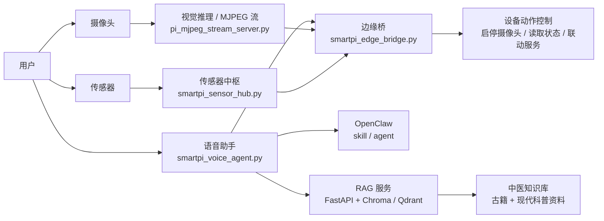

# smartpi

smartpi 是一个运行在树莓派上的中医智能助手项目，围绕“边缘感知、语音交互、知识检索、设备联动”构建。项目把舌象视觉分析、语音助手、传感器采集、OpenClaw 智能体协同，以及中医知识库 RAG 服务整合到同一套设备侧系统中。

它不是单点功能演示，而是一套面向真实设备运行场景的多模块协同工程。

## 项目亮点

- 树莓派本地运行的语音助手主链路
- 摄像头舌象识别与 MJPEG 检测流
- 体征传感器采集与本地状态接口
- 中医知识库 RAG 检索、重排、引用回答
- OpenClaw 智能体技能接入
- 面向 systemd 的服务化部署结构

## 系统架构



## 核心能力

- **边缘视觉推理**
  - 摄像头采集图像或视频帧
  - ONNX 推理输出
  - MJPEG 实时检测流
  - 舌象相关分类结果对外提供

- **语音助手链路**
  - 唤醒词监听
  - 本地录音与语音识别
  - 本地或云端 TTS 播报
  - 直接调用 LLM 或联动 OpenClaw
  - 通过动作标记控制本地设备

- **设备与传感器联动**
  - 摄像头服务启停
  - 边缘桥统一动作入口
  - 传感器数据采集与上传
  - 本地运行状态查询

- **中医知识库 RAG**
  - 文档导入、分块、元数据管理
  - 向量检索 + BM25 混合召回
  - reranker 重排序
  - metadata filter
  - query rewrite
  - 找不到就拒答

- **智能体协同**
  - OpenClaw skill 触发设备动作
  - 将自然语言请求映射为本地控制指令
  - 语音层与智能体层解耦

## 默认服务与端口

| 模块 | 作用 | 默认端口 |
| --- | --- | --- |
| `pi_mjpeg_stream_server.py` | 摄像头检测流 | `8081` |
| `smartpi_sensor_hub.py` | 传感器中枢 | `8091` |
| `smartpi_edge_bridge.py` | 边缘桥 | `8092` |
| `smartpi_voice_agent.py` | 语音助手 | `8093` |
| `rag-chroma/app/main.py` | RAG API | `8094` / `8095` |

## 仓库结构

- `edge/`
  树莓派设备侧主控层，包含语音代理、边缘桥、传感器服务、流媒体服务、安装脚本与 systemd 服务文件。

- `rag-chroma/`
  当前主用的中医知识库 RAG 服务，基于 FastAPI，支持本地开发和树莓派部署。

- `config/`
  运行配置模板，包括语音代理、边缘桥、传感器和 MJPEG 服务配置。

- `openclaw/`
  OpenClaw 集成脚本、skill 文档和本地调用入口。

- `openclaw-runtime/`
  从运行环境中回收的已安装 skill 内容，用于对照项目定义与运行态技能。

- `openclaw-workspace/`
  OpenClaw 工作区公开文档。

- `yolo_clean/`
  与视觉推理相关的 YOLO / ONNX 代码与兼容脚本。

- `yolo-prj/`
  小型实验性视觉代码目录。

更详细的目录职责见 [PROJECT_STRUCTURE.md](PROJECT_STRUCTURE.md)。

## 已实现效果

当前仓库对应的系统已经具备以下工程能力：

- 可以在树莓派侧运行语音代理、边缘桥、传感器服务和摄像头检测流
- 可以通过本地语音链路完成唤醒、识别、播报与动作触发
- 可以通过 OpenClaw skill 将自然语言请求映射为本地控制行为
- 可以通过 RAG 服务检索中医知识并返回带引用回答
- 可以将古籍资料和现代中医科普资料混合导入知识库
- 可以按服务拆分部署，并通过 systemd 常驻运行

## 典型工作流程

1. 用户通过语音向设备提问，或请求打开摄像头、读取数据、执行某个动作。
2. `smartpi_voice_agent.py` 完成唤醒、录音、识别和初步决策。
3. 若涉及设备联动，请求通过 `smartpi_edge_bridge.py` 统一转发到本地服务。
4. 若涉及知识问答，请求进入 `rag-chroma/` 检索中医知识库并生成带引用回答。
5. 若启用 OpenClaw，则可由 skill/agent 层进一步参与决策和动作编排。

## 快速开始

### 1. 本地查看与开发 RAG

适合先在 Windows 上验证知识库导入、检索和 API：

```powershell
cd D:\RAG\Smart-pi-source\rag-chroma
python -m venv .venv
.\.venv\Scripts\Activate.ps1
pip install -r requirements.txt
Copy-Item .env.example .env
.\scripts\start_dev.ps1
```

导入样例资料：

```powershell
.\scripts\ingest_sample.ps1
python scripts\query_cli.py "舌苔黄腻说明什么" --include-chunks
```

### 2. 树莓派部署主链路

以下步骤对应项目当前的设备侧结构：

```bash
cd /home/pi
git clone https://github.com/caiyi6173-ship-it/Smart-pi-source.git smartpi
cd /home/pi/smartpi
python3 -m venv venv
source venv/bin/activate
pip install --upgrade pip
```

准备配置文件：

```bash
cp config/voice_agent.env.example config/voice_agent.env
cp config/edge_bridge.env.example config/edge_bridge.env
cp config/sensor_hub.env.example config/sensor_hub.env
cp config/mjpeg_stream.env.example config/mjpeg_stream.env
```

安装本地语音链路依赖：

```bash
bash edge/pi_install_local_voice_stack.sh
```

安装 OpenClaw 集成：

```bash
bash edge/pi_install_openclaw.sh
bash edge/pi_install_smartpi_openclaw_skill.sh
```

### 3. 部署 RAG 服务

```bash
cd /home/pi/smartpi/rag-chroma
python3 -m venv .venv
source .venv/bin/activate
pip install -r requirements.txt
cp .env.example .env
```

如果要走 service 方式，可使用：

```bash
bash deploy/bootstrap_pi.sh /home/pi/smartpi/rag-chroma
sudo systemctl enable smartpi-rag.service
sudo systemctl start smartpi-rag.service
```

## 推荐部署顺序

在树莓派上建议按下面顺序逐步启动：

1. 先确认模型、音频设备、摄像头、I2C 传感器可用
2. 启动 `smartpi_sensor_hub`
3. 启动 `smartpi-edge-stream`
4. 启动 `smartpi-edge-bridge`
5. 启动 `smartpi-voice-agent`
6. 最后接入 `smartpi-rag`

## 运行依赖

- Raspberry Pi
- Python 3
- 摄像头
- 麦克风 / 扬声器
- 可选传感器模块
- ONNX 模型文件
- DashScope API Key
- 可选 Docker 环境

## 配置说明

重点配置文件：

- `config/voice_agent.env.example`
- `config/edge_bridge.env.example`
- `config/sensor_hub.env.example`
- `config/mjpeg_stream.env.example`
- `rag-chroma/.env.example`

其中常见关键项包括：

- `DASHSCOPE_API_KEY`
- `DIRECT_LLM_MODEL`
- `OPENCLAW_COMMAND`
- `BRIDGE_BASE_URL`
- `BACKEND_BASE_URL`
- `SHERPA_KWS_MODEL_DIR`
- `PIPER_MODEL_PATH`

## 知识库说明

`rag-chroma/` 当前支持导入：

- 中医古籍文本
- 现代中医药基础科普资料
- Markdown / TXT / PDF / DOCX 等文本资料

检索链路目前包含：

- query rewrite
- 多路召回
- 向量检索
- BM25 检索
- reranker 重排序
- 相似度阈值过滤
- 找不到就拒答

## 安全说明

- 本项目中的 RAG 回答仅供中医知识参考，不能替代医生诊断。
- 涉及急症、孕产、儿童、严重慢病、药物冲突等情况时，应优先建议线下就医。
- 请不要将真实密钥、`.env`、模型权重、日志、缓存和采集媒体直接提交到仓库。

## 后续方向

- 树莓派端 `smartpi` 路径与 systemd 服务的完整迁移验证
- RAG 测试环境与自动化测试补齐
- YOLO 目录进一步收敛
- 顶层部署文档和硬件接线说明补齐

## 相关文档

- [PROJECT_STRUCTURE.md](PROJECT_STRUCTURE.md)
- [DEPLOY_RASPBERRY_PI.md](DEPLOY_RASPBERRY_PI.md)
- [CONTRIBUTING.md](CONTRIBUTING.md)
- [CHANGELOG.md](CHANGELOG.md)
- [rag-chroma/README.md](rag-chroma/README.md)
